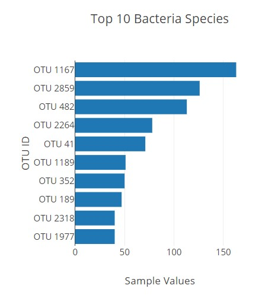
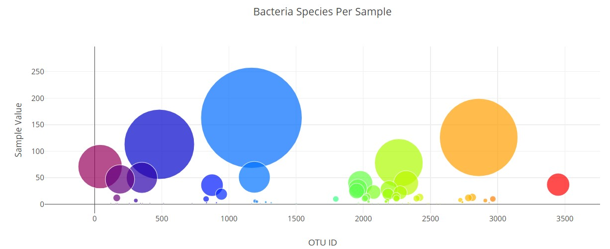
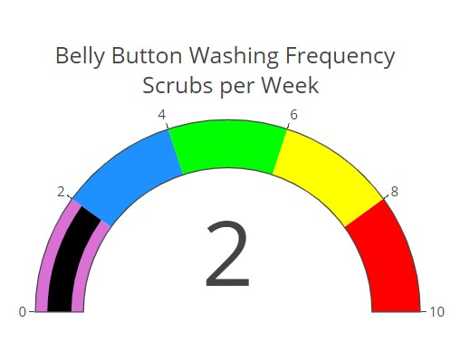

# Belly Button Biodiversity

## Overview
 We are tasked with creating an interactive dashboard that can be utlized to help volunteers identify the top bacteria that colonize their  belly buttons. The data will be used to assist Improbable Beef with the creation of genetically modified beef. Plotly, a JavaScript data visulatization library was used to create the dashboard.
 
 ## Summary
 A Horizontal Bar Chart, a Bubble Chart, and Gauge Chart was created. 
 
 
 
 
